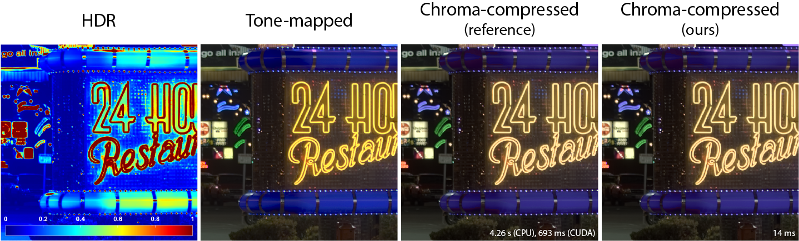

# Deep chroma compression of tone-mapped images

High dynamic range (HDR) imaging is an important technology targeting the acquisition, display, and storage of high-fidelity images that contain a considerably wider luminance spectrum than conventional images. Due to the limited capacity of traditional monitors to display HDR images, range reduction techniques are employed to generate standard dynamic range (SDR) images that can be accurately reproduced. However, these techniques correct primarily the luminance, but subsequent color adjustment (chroma compression) may be performed to remove any remaining chromatic distortions or color clipping artifacts (see figure above). While multiple analytic techniques exist for chroma compression, this code provides the first deep learning-based method for the task.

The code is heavily based on the seminal generative adversarial network (GAN) [pix2pix](https://github.com/junyanz/pytorch-CycleGAN-and-pix2pix), and was adapted to mimic the chroma-compression accuracy of a conventional technique proposed by [Šikudová et al](https://ieeexplore.ieee.org/document/7325187). Our method can generate images matching the color accuracy and visual quality of this technique, while being 2-3 orders of magnitude faster. Therefore, it offers the possibility for deployment on devices with limited computational resources. A large custom dataset including new and existing HDR images, as well as trained models, are also provided. 

**Note**: This implementation was tested on Rocky Linux 8.5, using Python 3.10 and PyTorch 1.13.


## Getting Started

### Installation
Clone this repo:
```bash
git clone https://github.com/DeepCamera/HDR-chroma-compression
cd HDR-chroma-compression
```

It is suggested to create a new conda environment, named e.g. `hdr`:
```bash
conda create --name hdr
conda activate hdr
```

Install [PyTorch](http://pytorch.org) and dependencies; for pip users, use:
```bash
pip install -r requirements.txt
```

### Training
Download our [dataset](##dataset) and place all folders (train*, val*, test*) in `./datasets/hdr/`. Train a model using:
```bash
python train.py --dataroot ./datasets/hdr --name hdr_exp1
```
At a minimum, you need to specify the dataset path (`--dataroot`). See the files within `./options/` for all available parameters. Model weights, training parameters, a log file with losses per epoch and example reference and predicted images per epoch are saved in `./checkpoints/`. To see the images in a web browser, open `./checkpoints/hdr_exp1/web/index.html`.

If you would like to train a model using a different dataset, prepare it in the same structured format as our dataset.

### Testing
Test a trained model using:
```bash
python test.py --dataroot ./datasets/hdr --name hdr_exp1 --num_test 100
```
At a minimum, you need to specify the dataset path (`--dataroot`). It is also suggested to specify the number of test images (`--num_test`). See the files within `./options/` for all available parameters. The test results (reference and predicted images) are saved in `./results/`. To see the images in a web browser, open `./results/hdr_exp1/index.html`.


Please refer to the [pix2pix implementation](https://github.com/junyanz/pytorch-CycleGAN-and-pix2pix) for additional resources on training, testing and troubleshooting.


## Dataset


<br>

Download the extensive [dataset](https://gofile.me/74Y5j/WVwAkJE9q) used in our study. The dataset contains 1467 HDR images at a resolution of 512×512 pixels, covering a diverse range of scenes and lighting conditions. HDR images were tone-mapped using 29 different oparators to create a total of 42543 SDR images for improving the generalization capabilities of the trained models (see (tbd)............... for the full list of operators). We also provide the chroma-compressed versions produced using the conventional method by [Šikudová et al](https://ieeexplore.ieee.org/document/7325187). Pairs of tone-mapped and chroma-compressed SDR images were split into training, validation, and test subsets at an 8:1:1 ratio, and are available for direct usage with the code. For example, folder `trainA` includes the tone-mapped images, `trainB` the chroma-compressed images, and `train` their concatenation as required by the code.

HDR images were captured by the authors or collected from different publicly available HDR repositories, which we cite below:

```
@inproceedings{StuttgartHDR,
  author = {Jan Froehlich and Stefan Grandinetti and Bernd Eberhardt and Simon Walter and Andreas Schilling and Harald Brendel},
  title = {Creating cinematic wide gamut HDR-video for the evaluation of tone mapping operators and HDR-displays},
  volume = {9023},
  booktitle = {Digital Photography X},
  editor = {Nitin Sampat and Radka Tezaur and Sebastiano Battiato and Boyd A. Fowler},
  organization = {International Society for Optics and Photonics},
  publisher = {SPIE},
  pages = {90230X},
  keywords = {High Dynamic Range, HDR-Video, Wide Gamut, Tone Mapping},
  year = {2014},
  doi = {10.1117/12.2040003},
  URL = {https://doi.org/10.1117/12.2040003}
}
```
```
@inproceedings{NemotoEPFL,
  title = {Visual attention in LDR and HDR images},
  author = {Nemoto, Hiromi and Korshunov, Pavel and Hanhart, Philippe  and Ebrahimi, Touradj},
  year = {2015},
  booktitle = {9th International Workshop on Video Processing and Quality Metrics for Consumer Electronics (VPQM)},
  publisher = {Springer-Verlag},
  url = {http://infoscience.epfl.ch/record/203873},
}
```
```
@inproceedings{FairchildHDRSurvey,
  title = {The HDR Photographic Survey},
  author = {Mark D. Fairchild},
  booktitle = {International Conference on Communications in Computing},
  pages = {233--238},
  publisher = {IS\&T Publications},
  year = {2007}
}
```
```
@inproceedings{StanfordHDR,
  author = {Feng Xiao and Jeffrey M. DiCarlo and Peter B. Catrysse and Brian A. Wandell},
  title = {High Dynamic Range Imaging of Natural Scenes},
  booktitle = {The Tenth Color Imaging Conference: Color Science and Engineering Systems, Technologies, Applications, {CIC} 2002, Scottsdale, Arizona, USA, November 12-15, 2002},
  pages = {337--342},
  publisher = {Society for Imaging Science and Technology},
  year = {2002},
  url = {https://doi.org/10.2352/CIC.2002.10.1.art00062},
  doi = {10.2352/CIC.2002.10.1.ART00062},
}
```
```
@article{UBCHDR,
  title = {Evaluating the performance of existing full-reference quality metrics on high dynamic range (HDR) video content},
  author = {Azimi, Maryam and Banitalebi-Dehkordi, Amin and Dong, Yuanyuan and Pourazad, Mahsa T and Nasiopoulos, Panos},
  journal = {arXiv preprint arXiv:1803.04815},
  year = {2018}
}
```
```
@inproceedings{Hold-Geoffroy19,
  author = {Yannick Hold-Geoffroy and Akshaya Athawale and Jean-Fran\c{c}ois Lalonde},
  title = {Deep Sky Modeling For Single Image Outdoor Lighting Estimation},
  booktitle = {IEEE/CVF Conference on Computer Vision and Pattern Recognition (CVPR)},
  publisher = {IEEE},
  pages = {6920--6928},
  year = {2019},
}
```
```
@article{Gardner2017,
  author = {Gardner, Marc-Andr\'{e} and Sunkavalli, Kalyan and Yumer, Ersin and Shen, Xiaohui and Gambaretto, Emiliano and Gagn\'{e}, Christian and Lalonde, Jean-Fran\c{c}ois},
  title = {Learning to Predict Indoor Illumination from a Single Image},
  year = {2017},
  issue_date = {December 2017},
  publisher = {Association for Computing Machinery},
  address = {New York, NY, USA},
  volume = {36},
  number = {6},
  issn = {0730-0301},
  url = {https://doi.org/10.1145/3130800.3130891},
  doi = {10.1145/3130800.3130891},
  journal = {ACM Trans. Graph.},
  month = {November},
  articleno = {176},
  numpages = {14},
  keywords = {indoor illumination, deep learning}
}
```
```
@article{Akyuz2007,
  author = {Ahmet Oguz Aky{\"{u}}z and Roland W. Fleming and Bernhard E. Riecke and Erik Reinhard and Heinrich H. B{\"{u}}lthoff},
  title = {Do {HDR} displays support {LDR} content?: a psychophysical evaluation},
  journal = {{ACM} Trans. Graph.},
  volume = {26},
  number = {3},
  pages = {38},
  year = {2007},
  url = {https://doi.org/10.1145/1276377.1276425},
  doi = {10.1145/1276377.1276425},
}
```
```
@misc{HDRLabs2013,
  author = {HDRLabs},
  title = {sIBL Archive Free HDRI sets for Smart Image-Based Lighting},
  year = {2013},
  url = {https://hdrlabs.com},
}
```


## Trained weights
Download our pre-trained model [weights](https://gofile.me/74Y5j/siBbONZ1l).


## Citation
If you use either of the code, dataset, or pre-trained model weights for your research, please cite our paper:
```
@article{

(tbd)....................

}
```
Please also cite the [pix2pix](https://ieeexplore.ieee.org/document/8100115) paper if you use the code or pre-trained model weights:
```
@inproceedings{Isola2017,
  author={Isola, Phillip and Zhu, Jun-Yan and Zhou, Tinghui and Efros, Alexei A.},
  booktitle={2017 IEEE Conference on Computer Vision and Pattern Recognition (CVPR)}, 
  title={Image-to-Image Translation with Conditional Adversarial Networks}, 
  year={2017},
  volume={},
  number={},
  pages={5967-5976},
  keywords={Gallium nitride;Generators;Training;Image edge detection;Force;Image resolution},
  doi={10.1109/CVPR.2017.632}
}

```